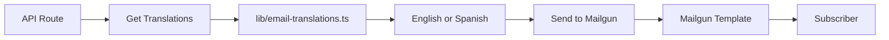

# Mailgun Template Setup - Quick Summary

## Overview

Your feedback email system now supports **ONE Mailgun template** with translations managed in your codebase.

## ✅ What's Been Created

### 1. **Translation System** (`lib/email-translations.ts`)
- All email text in English and Spanish
- Easy to update without touching HTML
- Type-safe translations
- Add new languages easily

### 2. **Template-Based API Route** (`route-with-templates.ts`)
- Uses external Mailgun template
- Passes translations as variables
- ~70% less code than inline HTML version
- Same functionality, cleaner code

### 3. **Documentation**
- `MAILGUN_FEEDBACK_TEMPLATE_SIMPLE.md` - Complete template HTML (copy-paste ready)
- `MAILGUN_TEMPLATE_MIGRATION.md` - Migration guide with best practices

## 🚀 Quick Start

### Step 1: Create Template in Mailgun

1. Login to Mailgun Dashboard
2. Go to **Sending** > **Templates**
3. Click **Create Template**
4. Name: `feedback-survey`
5. Copy HTML from `docs/MAILGUN_FEEDBACK_TEMPLATE_SIMPLE.md`
6. Save template

### Step 2: Add Environment Variable

Add to your `.env.local`:

```bash
MAILGUN_FEEDBACK_TEMPLATE=feedback-survey
```

### Step 3: Switch to Template Version

```bash
# Backup current version
mv app/api/newsletter/feedback/send/route.ts app/api/newsletter/feedback/send/route-inline.ts.backup

# Activate template version
mv app/api/newsletter/feedback/send/route-with-templates.ts app/api/newsletter/feedback/send/route.ts
```

### Step 4: Test

Send a test email from `/admin/feedback` to verify it works!

## 📝 Updating Translations

### To update email text:

1. Edit `lib/email-translations.ts`
2. Find the text you want to change
3. Update for both `en` and `es`
4. Deploy - no Mailgun changes needed!

Example:

```typescript
export const feedbackEmailTranslations = {
  en: {
    subject: 'Calibrate your content signal', // ← Change this
    // ...
  },
  es: {
    subject: 'Calibra tu señal de contenido', // ← Change this
    // ...
  },
};
```

## 📧 Updating Template Design

### To update HTML/CSS:

1. Update template in Mailgun dashboard
2. Save updated HTML to `docs/MAILGUN_FEEDBACK_TEMPLATE_SIMPLE.md`
3. Commit to Git
4. No code deployment needed!

## 🔄 Rollback to Inline HTML

If you need to rollback:

```bash
# Restore original version
mv app/api/newsletter/feedback/send/route.ts app/api/newsletter/feedback/send/route-with-templates.ts
mv app/api/newsletter/feedback/send/route-inline.ts.backup app/api/newsletter/feedback/send/route.ts
```

## ⚙️ How It Works



1. **API gets translations** from `lib/email-translations.ts` based on subscriber language
2. **Passes all text as variables** to Mailgun template
3. **Mailgun renders template** with provided text
4. **Email sent** with correct language

## 📊 Benefits

| Feature | Inline HTML | Mailgun Template |
|---------|-------------|------------------|
| **Code size** | ~765 lines | ~250 lines |
| **Update translations** | Redeploy code | Edit TS file, redeploy |
| **Update design** | Redeploy code | Update in Mailgun, no deploy |
| **A/B testing** | ❌ | ✅ In Mailgun |
| **Version control** | ✅ Full | ✅ Translations, ⚠️ HTML in Mailgun |
| **Preview** | In code only | Mailgun dashboard |

## 🎯 Best Practices

### ✅ DO:
- Keep translations in `lib/email-translations.ts`
- Update both English and Spanish together
- Test with both languages
- Save template HTML to Git after updates
- Use descriptive variable names

### ❌ DON'T:
- Put translations in Mailgun template
- Use multiple templates for languages
- Hard-code text in template HTML
- Forget to update documentation

## 🧪 Testing Checklist

Before deploying:

- [ ] Create template in Mailgun
- [ ] Set `MAILGUN_FEEDBACK_TEMPLATE` env var
- [ ] Send test email (English subscriber)
- [ ] Send test email (Spanish subscriber)
- [ ] Verify all buttons work
- [ ] Check mobile rendering
- [ ] Test unsubscribe link

## 🆘 Troubleshooting

### "Template not found"
- Verify template name matches `MAILGUN_FEEDBACK_TEMPLATE`
- Check template is active in Mailgun dashboard

### "Variables not rendering"
- Ensure using `h:X-Mailgun-Variables` header
- Check JSON.stringify() on variables object

### "Wrong language"
- Verify subscriber has correct `lang` field in database
- Check `getFeedbackEmailTranslations()` is called with correct lang

## 📚 Files Reference

```
lib/
  email-translations.ts          # ← Update translations here

app/api/newsletter/feedback/send/
  route.ts                        # Current active version
  route-with-templates.ts         # Template version (use this)
  route-inline.ts.backup          # Original inline HTML version

docs/
  MAILGUN_FEEDBACK_TEMPLATE_SIMPLE.md  # ← Copy HTML from here
  MAILGUN_TEMPLATE_MIGRATION.md        # Full migration guide
  MAILGUN_SETUP_SUMMARY.md             # This file
```

## 🎉 You're Done!

Your feedback email system is now using external templates with code-managed translations. Enjoy easier maintenance and faster updates!

---

**Need help?** Check `MAILGUN_TEMPLATE_MIGRATION.md` for detailed instructions.
